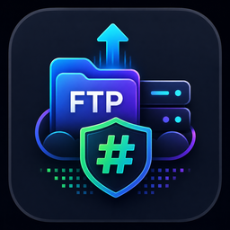

<div align="center">
  
</div>

# FTP Hash Deploy Action

[](https://github.com/marketplace/actions/ftp-hash-deploy)

> Deploy only changed files via FTP/FTPS — using server-side **Git-style hashing**.

No state files. No timestamp guesswork. The server tells you what it has. You upload only what changed.

## How it works

1. Uploads `hashme.php` to the server via FTPS
2. Fetches the server's file hashes via HTTP — computed as **Git blob hashes** (`SHA1(blob {len}\0{content})`)
3. Deletes `hashme.php`
4. Computes the same hashes locally
5. Uploads only files where hashes differ — deletes files no longer present locally

The hash algorithm is identical to Git's own object hashing. If a file has the same Git blob hash on server and locally, it is bit-for-bit identical and won't be re-uploaded.

## No state file, ever

There's nothing to lose, corrupt, or let go stale — every deploy asks the server directly what it already has, via the same hash Git uses for its own objects. Delete everything, rerun on a fresh CI runner, doesn't matter: the result is always correct, because the server's own files are the only source of truth.

## Usage

```yaml
- name: Deploy
  uses: Agundur-KDE/ftp-hash-deploy-action@v1
  with:
    ftp-host:     ${{ secrets.FTP_HOST }}
    ftp-user:     ${{ secrets.FTP_USER }}
    ftp-password: ${{ secrets.FTP_PASSWORD }}
    site-url:     https://example.com
    local-dir:    ./dist/
    server-dir:   /public_html/
```

## Inputs

| Input | Required | Default | Description |
|---|---|---|---|
| `ftp-host` | ✓ | — | FTP server hostname |
| `ftp-user` | ✓ | — | FTP username |
| `ftp-password` | ✓ | — | FTP password |
| `site-url` | ✓ | — | Public URL (for fetching hashes via `hashme.php`) |
| `ftp-port` | | `21` | FTP port |
| `ftps` | | `true` | Use FTPS explicit TLS |
| `local-dir` | | `./` | Local directory to deploy |
| `server-dir` | | `/` | **Web root on the FTP server** — the path where your site files live |
| `dry-run` | | `false` | Show diff without uploading |

### Finding your `server-dir`

The FTP account root (`/`) is usually not the web root. Set `server-dir` to wherever your site files live:

| Host type | Typical `server-dir` |
|---|---|
| All-Inkl, Strato, Ionos | `/web/` |
| cPanel hosts | `/public_html/` |
| Plesk hosts | `/httpdocs/` |
| Custom / root-level | `/` |

When in doubt: log in via FTP and look for the directory that contains your `index.html`.

## Troubleshooting

**Connection timeout / connection refused / "control socket" errors**

- Uses **passive FTP mode by default** (Python's `ftplib` default) — this already avoids most firewall issues, since it doesn't require the server to open an inbound connection back to the runner.
- The connection timeout is currently fixed at 30 seconds, not user-configurable.
- If your host requires **implicit** FTPS (typically port 990) instead of **explicit** FTPS (port 21, what this action uses), the connection will fail — check with your host which one they expect.
- If your host doesn't support FTPS at all, set `ftps: false` to fall back to plain FTP.
- **IP allowlisting**: GitHub-hosted runners use a large, changing range of IP addresses. If your FTP server restricts access to specific IPs, deploys from GitHub Actions will be blocked regardless of correct credentials — you'll need a self-hosted runner or to open the firewall for GitHub's published IP ranges.

**Before debugging further:** run with `dry-run: true` first. It connects, authenticates, and computes the full diff without transferring anything — most config problems (wrong port, wrong `server-dir`, bad credentials) show up here without any risk to your live site.

## Requirements

- Server must run **PHP** (for `hashme.php`)
- FTP or FTPS access
- Public HTTP access to the site URL during deploy

Inspired by [SamKirkland/FTP-Deploy-Action](https://github.com/SamKirkland/FTP-Deploy-Action) (MIT).

## License

MIT © [Agundur-KDE](https://github.com/Agundur-KDE)
